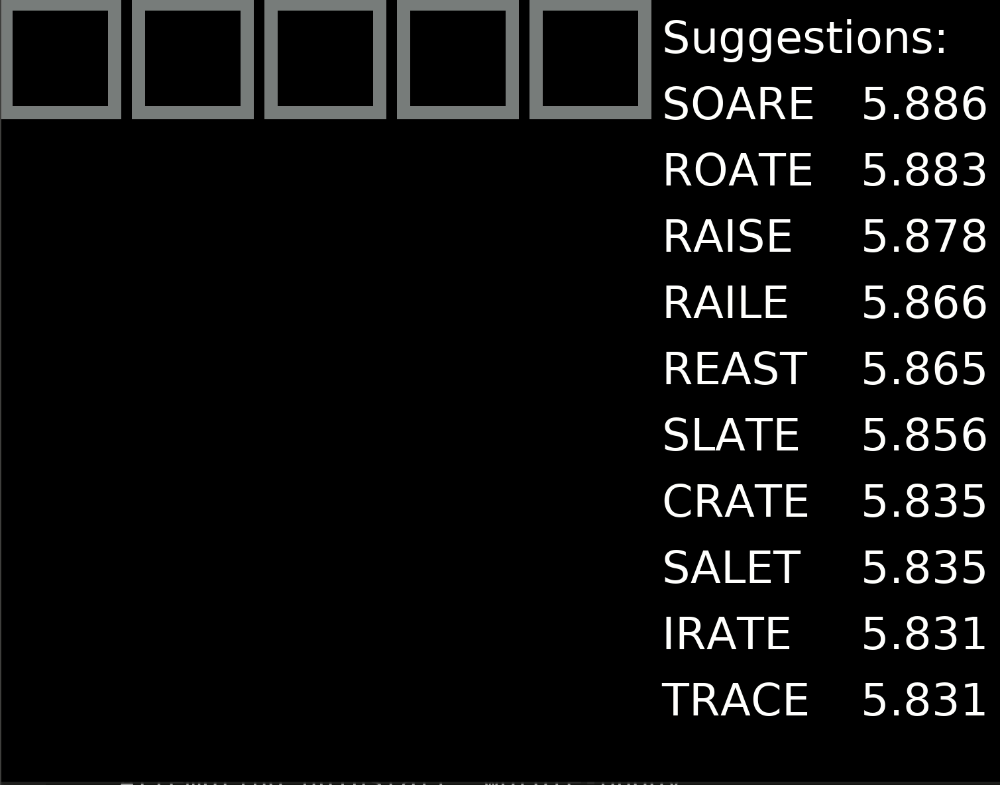
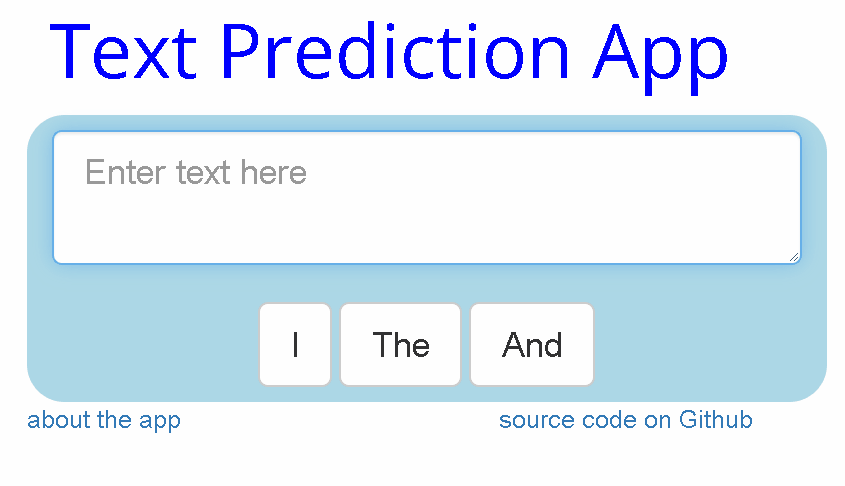
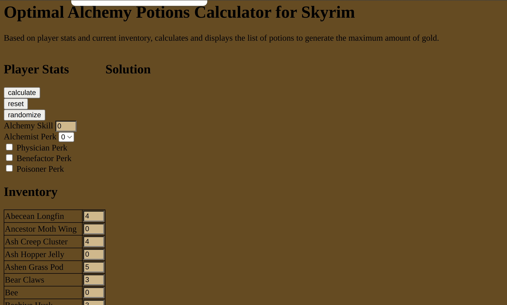

## Wordle Buddy

Developed an assistant for playing Wordle as a Python package (available to install via `pip install wordle-buddy`).

## Text Prediction

Developed a back-off model (a kind of n-gram model) for predicting the next word in a given sequence. Deployed as a Shiny [app](https://ericoden.shinyapps.io/text_prediction/).

## Alchemy

Developed an integer programming model to determine the profit-maximizing potions to brew in the game Skyrim. Deployed as a Heroku [app](http://skyrim-alchemy-app.herokuapp.com/).

